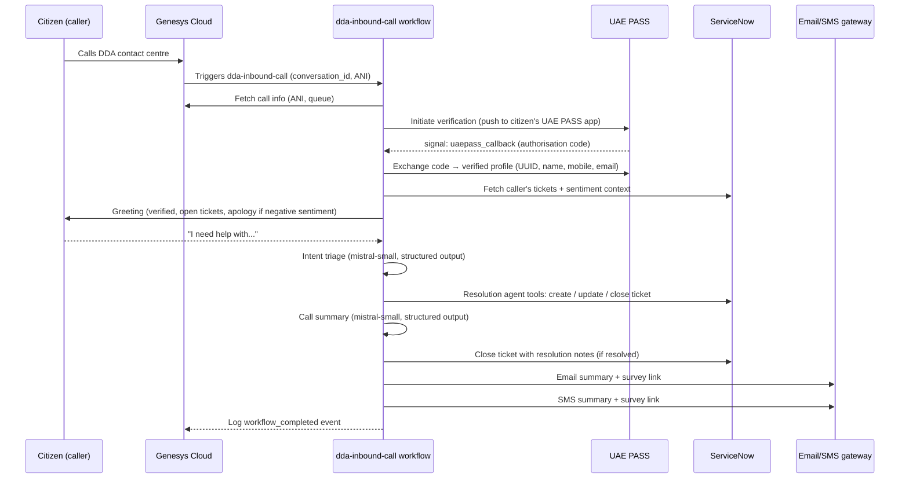

# Architecture

## Sequence

## Workflow structure

The workflow (`src/workflows/inbound_call.py`) is a single `InteractiveWorkflow`:

1. **`fetch_call_info`** — Genesys activity: conversation → ANI + queue.
2. **UAEPASS authentication** — `start_uaepass_verification` activity, then
   `wait_condition` on the `uaepass_callback` signal (3 min timeout), then
   `exchange_uaepass_code` activity → `UaePassProfile`.
3. **Context building** — `fetch_caller_tickets` + `build_ticket_context`
   activities: open vs. recently-closed buckets and a sentiment label
   (`positive` / `neutral` / `negative`) used to tune the greeting.
4. **Dialogue** — `send_assistant_message` greeting, then
   `wait_for_input(ChatInput("How can I help you today?"))` (2 min timeout).
5. **Triage** — `analyse_intent` activity returns a structured `CallerIntent`.
6. **Resolution** — `Runner.run` with a `mistral-medium-latest` agent whose tools
   are the ServiceNow activities (`create_ticket`, `update_ticket`, `close_ticket`,
   `fetch_caller_tickets`), so the agent can act on ServiceNow directly.
7. **Summary** — `summarise_call` activity returns a structured `CallSummary`
   (summary, actions, outcome).
8. **Close-out** — `send_summary_email` + `send_summary_sms` with the survey URL
   (`SURVEY_URL_TEMPLATE.format(execution_id=...)`), then `log_call_event` to Genesys.

## Failure handling

- Activities have Temporal retry policies (ServiceNow fetch: 3 attempts).
- UAEPASS timeout → workflow returns `status="authentication_failed"` with a
  caller-friendly message instead of failing the execution.
- Dialogue timeout → `wait_for_input` raises `asyncio.TimeoutError`; the entrypoint
  returns a graceful `authentication_failed`-style result rather than an error.
- Because execution is durable, a worker crash mid-call resumes exactly at the
  suspended `wait_for_input` / `wait_condition` point.
