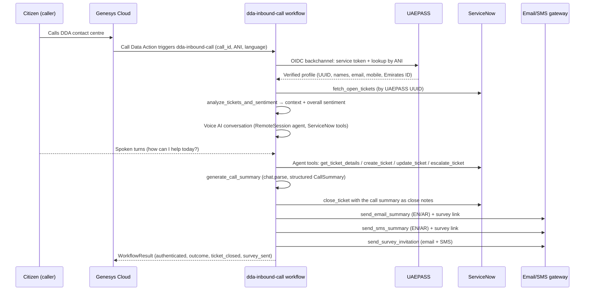

# Architecture

## Sequence

## Workflow structure

The workflow (`src/workflows/inbound_call.py`) is a standard durable workflow:

1. **`authenticate_uaepass`** — OIDC backchannel activity: service client token,
   then caller lookup by the verified phone number (ANI) → `CitizenIdentity`.
2. **Context building** — `fetch_open_tickets` (ServiceNow Table API by
   `u_epass_uuid`), then `analyze_tickets_and_sentiment` produces a
   `TicketContext` (tickets, overall sentiment, one-line summary).
3. **Voice conversation** — `run_voice_conversation`: a durable
   `RemoteSession` agent (`mistral-large-latest`) with voice-channel
   guardrails and bilingual instructions. The greeting acknowledges open
   tickets and empathizes when sentiment is negative, then asks
   "How can I help you today?" and resolves the request with the
   ServiceNow tools.
4. **Summary** — `generate_call_summary` uses `chat.parse_async` for a
   structured `CallSummary` (topic, resolution, follow-up actions, outcome).
5. **Close-out** — `close_ticket` records the resolution on the ticket
   (`state=7`, Solved (Permanently)); then `send_email_summary`,
   `send_sms_summary`, and `send_survey_invitation` deliver the bilingual
   summary plus the feedback survey link.

## Failure handling

- Activities have automatic retry policies (UAEPASS/ServiceNow: 3 attempts,
  exponential backoff).
- Email/SMS return `False` (not exceptions) when the citizen has no
  registered email/mobile, so the workflow always completes.
- If the caller's request cannot be resolved, the agent escalates the ticket
  via `escalate_ticket` and the summary records `outcome="escalated"`;
  Genesys can then transfer the call to the human support queue.
- Because execution is durable, a worker crash mid-call resumes exactly at
  the last completed activity.
- Secrets (UAEPASS, ServiceNow, email/SMS credentials) are read from the
  worker environment inside activities; they are never serialized into the
  workflow's event history.
