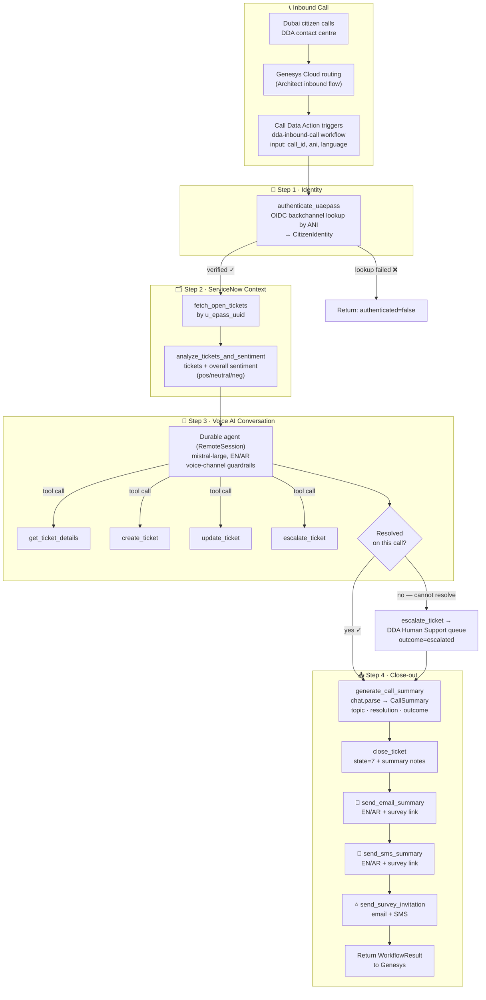
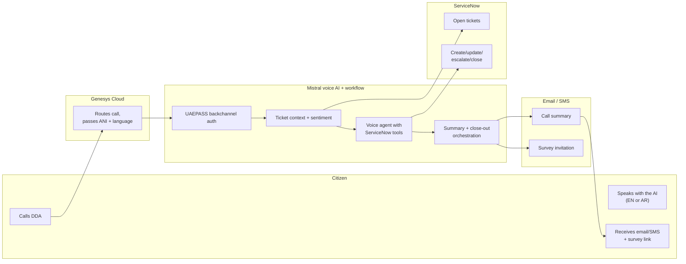

# DDA Inbound Call — Visual Workflow

## End-to-end call flow

## Swimlane view

## Sequence

See [architecture.md](architecture.md) for the full sequence diagram and
activity-by-activity description.
