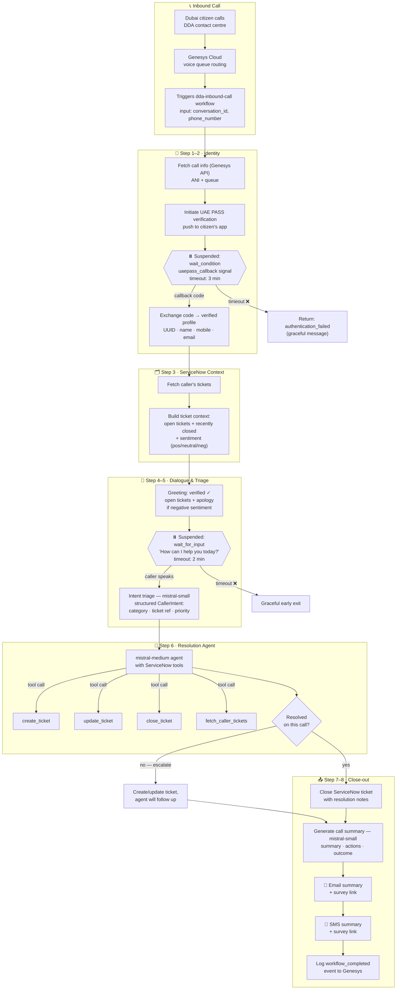
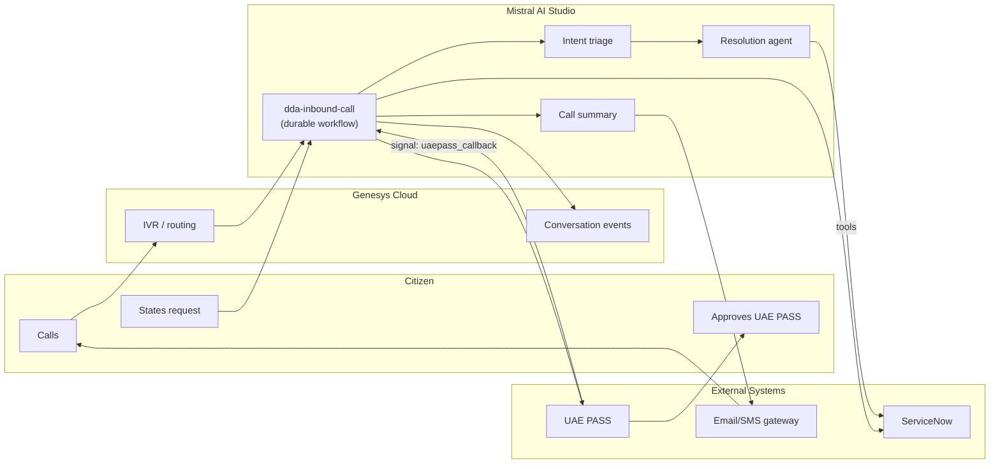
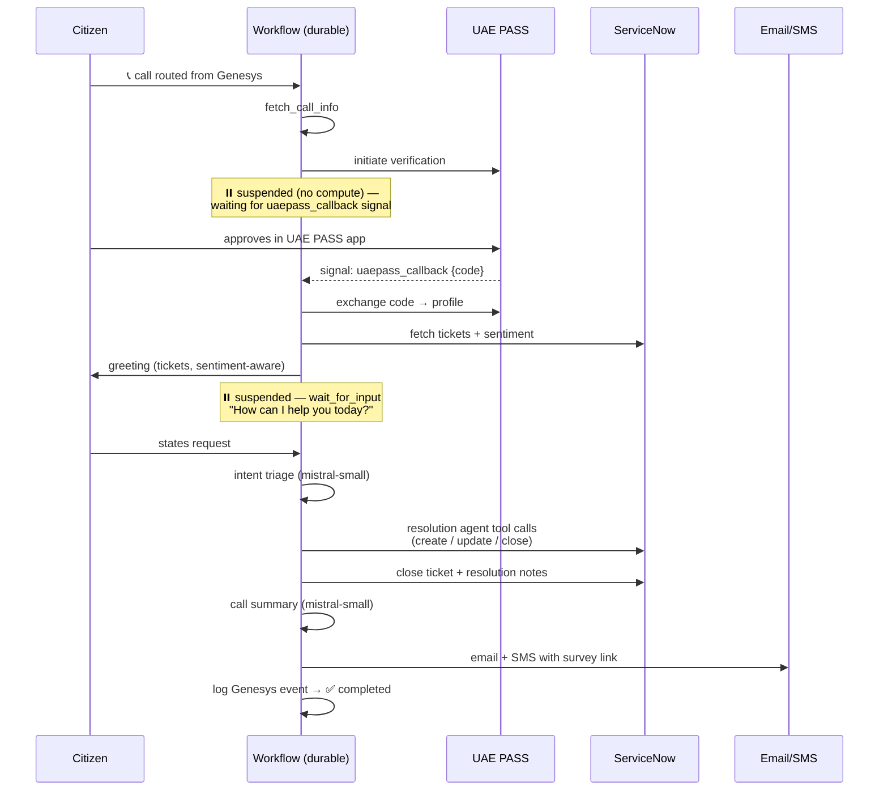

# DDA Inbound Call — Visual Workflow

## End-to-end call flow

## Swimlane view (who does what)

## Execution timeline (what Studio shows)

Key visual points:
- The two ⏸️ **suspension points** (UAE PASS approval, caller dialogue) are where the
  durable workflow parks at zero compute until an external event resumes it.
- **Sentiment** from ServiceNow history shapes the greeting (apology on negative).
- The **resolution agent** acts on ServiceNow directly through tools — no human
  routing unless it decides to escalate.
- **Every branch, retry, and state change** appears on the live execution timeline
  in Mistral AI Studio.
